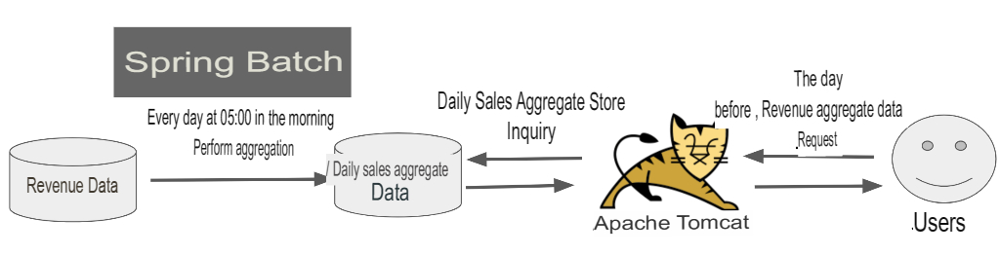

# 0. Ahead of the series

Spring Batch In Action has not been revised since 2011, and there is no Korean translation, and most of the Spring Batch articles in Korea are tutorials or short translations of some of the official documents.

> In the past, there was a Spring Batch series organized by Jeong Sang-hyeok, but it is not easy to find.

Batch applications are often written as much as web applications, especially for commerce sites.
It was difficult to find materials that could be delivered as guides when starting Spring Batch not only for me, but also for my surroundings and team.
I came up with the idea that it would take a day or two to write batches in a fist-fighting way.

> It's a personal wish, but I really hope that a lot of domestic data come out in other modules besides Spring MVC.

So let's get started!

# 1. What is a Batch Application?

> Batch means **batch processing**.

Let's say you need to aggregate data from the previous day every day.
Where can I do this aggregation process?
If you only know web applications, you probably think of Tomcat + Spring MVC.
However, if you read, process, and store such large data, the server will quickly exhaust its resources such as CPU and I/O, making it impossible to process other requests.

And this aggregation function is performed **once a day**.
Wouldn't it be too wasteful to construct an API for this?
What if there is too much additional data and a failure occurs during processing?
**If it fails on the 50,000th, how great would it be if you could redo it on the 50,001th**?

Also, there may be cases like this.
Someone ran the aggregation function this morning, and someone else ran it again, so the aggregation data might double.
**Wouldn't it be great if we could support a function that would fail because we've already run it when we run the same function with the same parameters**?

Applications that process large amounts of data in just such a one-off are called **batch applications**.
If you think about the above concerns again, you can see that **there are many additional parts to be concerned with other than business logic** in order to configure a batch application.

One thing to think about here is that when developing web applications, we can focus on business logic as much as possible.
Why?
Because it uses Spring MVC.
**By using Spring MVC, I was able to focus on the business logic as much as possible**.
Then, is there no module that supports such a batch application in Spring?

In the Spring camp, there is **Spring Batch**.

Before introducing Spring Batch, let's briefly talk about the conditions of what a batch application is.
A batch application must satisfy the following conditions.

- Large data - Batch applications must be able to process large amounts of data, such as fetching, passing, or calculating.
- Automation - Batch applications should **run without user intervention** except for critical troubleshooting.
- Robustness - Batch applications must be able to handle invalid data without crashing/hanging.
- Reliability - Batch applications should be able to track down what went wrong. (logging, notification)
- Performance - Batch applications must either **finish their processing in a specified amount of time** or perform without interfering with **other applications running concurrently**.

Now, let's meet Spring Batch that satisfies these conditions.

## 1-1. Spring Batch?

The Spring Batch project was born in 2007 as a collaboration between Accenture and Spring Source.
Accenture had years of hard work and experience gained from creating their own deployment framework.
In other words, **Spring Batch** was created by combining Accenture's batch know-how & technology with the Spring framework.

Spring Batch has inherited the characteristics of Spring.
So you can use all three elements of the Spring framework, such as **DI, AOP, and service abstraction**, while using Accenture's Batch know-how architecture.

Readers & Writers currently supported by Spring Batch 4.0 (Spring Boot 2.0) are as follows.
(Reader is a module that reads data, and Writer is a module that writes data.)

| DataSource | technology | Description                                    |
| ---------- | ---------- | ---------------------------------------------- |
| Database   | JDBC       | Paging, cursors, batch updates, etc. available |
| Database   | Hibernate  | Paging, cursor enabled                         |
| Database   | JPA        | Paging enabled (no cursor in current version)  |
| File       | Flat file  | Supports parsing with specified delimiters     |
| File       | XML        | XML parsing support                            |

> **iBatis module is now removed**.
> Those who have used iBatis as a reader are recommended to replace it with JDBC ItemReader.

In the future, we will introduce the technologies listed above, and introduce what problems can be solved one by one.

## 1-2. Batch vs Quartz?

Sometimes you see articles comparing Spring Batch and Spring Quartz.
The two have completely different roles.
**Quartz is a scheduler**, but it does not support function for processing large data batches like Batch \*\*.
Conversely, Batch also does not support various scheduling features of Quartz, so usually Quartz + Batch is used in combination.
You can think of it as a structure in which Quartz executes Spring Batch on a set schedule.

## 1-3. Batch case

In real enterprises, batch applications are used in the following situations.

### daily sales count

In the case of a commerce site where a lot of transactions are made, the number of transactions per day ranges from 500,000 to 1 million.
In this case, the data related to this is at least 1 million to 2 million rows.
It can be 50 million to 100 million in a month.

Resolving this with real-time aggregate query requires too much query time or server load.
So, if an external request comes by creating the previous day's sales aggregate data at dawn every day, **immediately forwarding the aggregate data created in advance**, you can catch both performance and load.

### ERP integration

Most services use ERP.

> Think of ERP as a resource management system.
> It refers to a software system that manages all sales, expenses, etc. as well as internal members.
> One of the most famous ERP solutions is SAP.
> It is easier to understand if you refer to [Namu Wiki](https://namu.wiki/w/ERP).

As a requirement of the finance team, Spring Batch is often used in situations where daily sales status needs to be delivered to ERP.
If you need to transmit sales data that needs to be delivered to ERP every morning at 8:00, you can easily implement it with the structure shown below.

## 1-4. Wrap-up

In addition to the above cases, Spring Batch can be used anywhere where **data processing is required at fixed times**.
In this time, we briefly looked at what a batch application is and what Spring Batch is.
From the next lesson, we will introduce them one by one while writing a simple example program in earnest.
